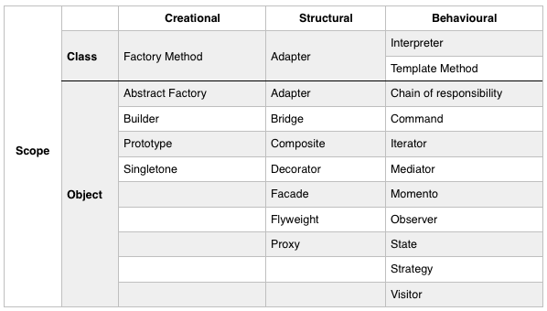

#Design patterns
1. Creational: It concerns about creation of an object
2. Behavioural: It characterise the way that classes or objects interact and distribute responsibility
3. Structural: It concerns about composition of objects and classes
